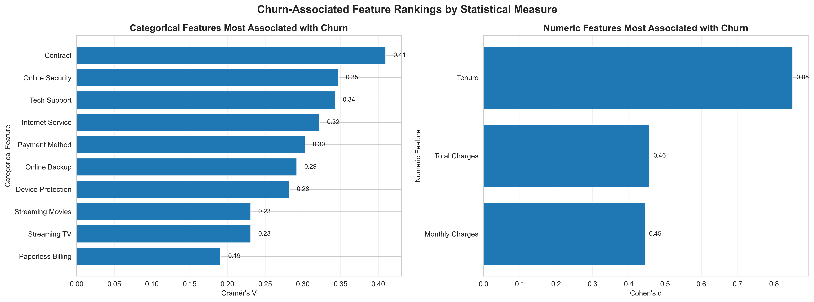
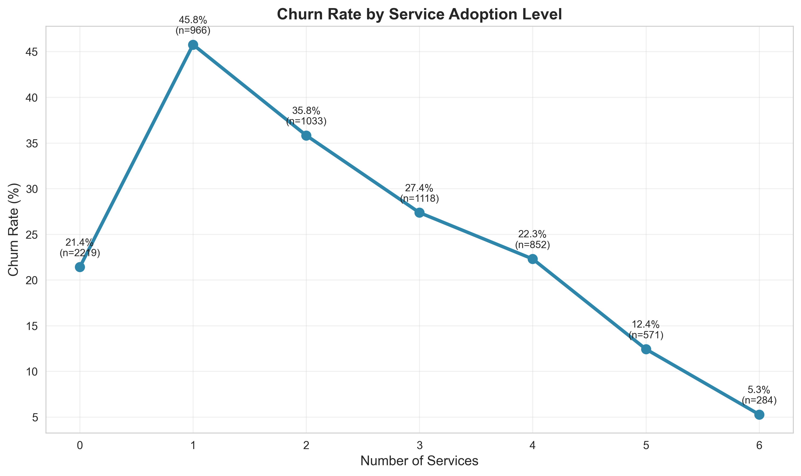
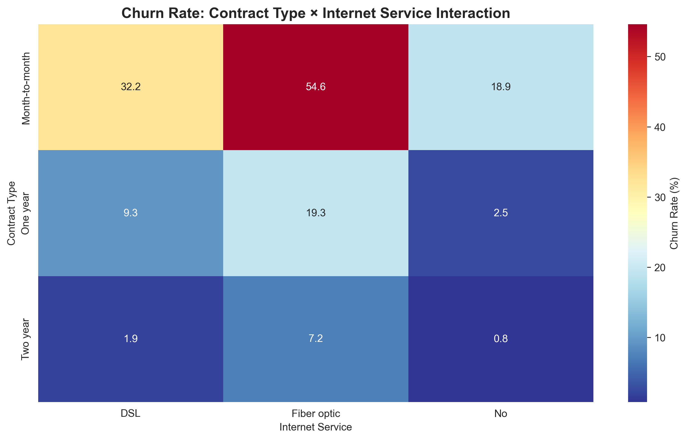
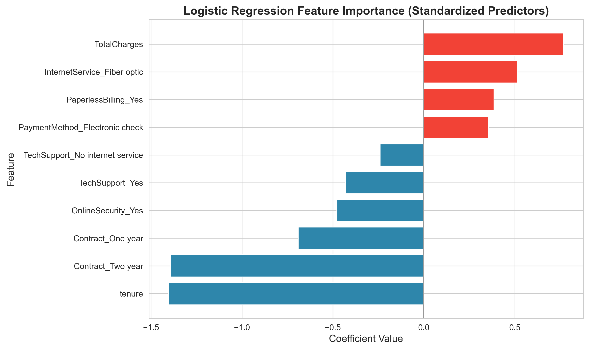
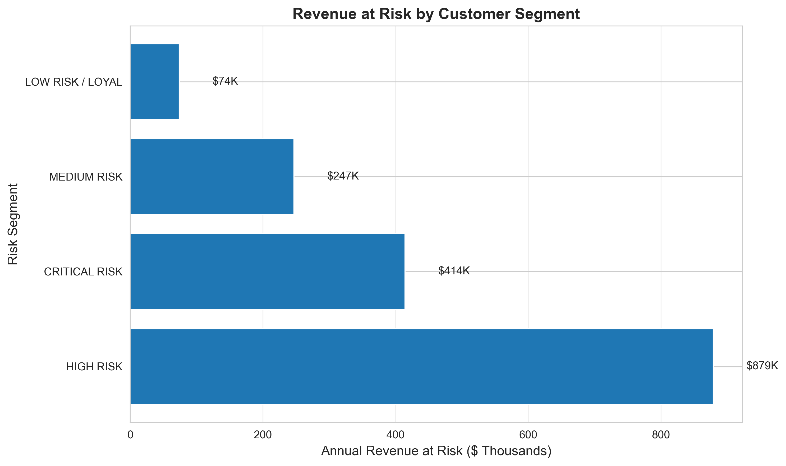
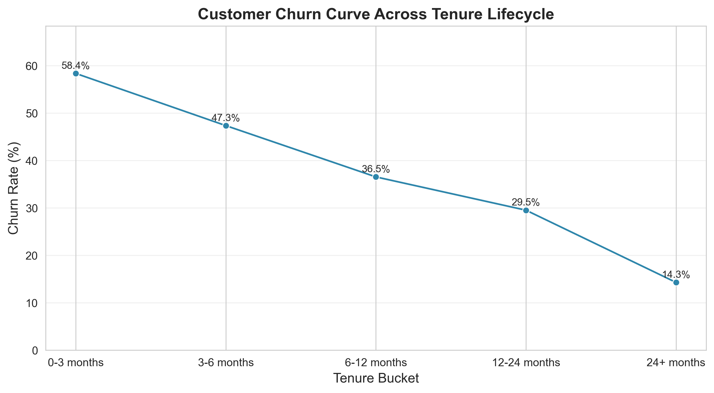
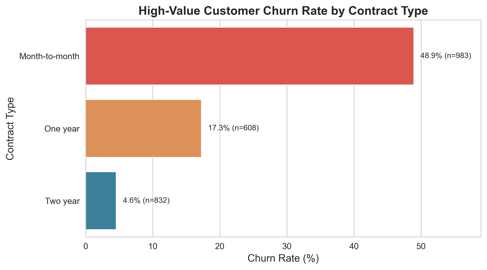

# Customer Churn Analysis: Revenue Protection Through Data-Driven Retention Strategy

**An end-to-end business analytics project identifying churn-associated patterns, quantifying revenue exposure, and translating customer data into actionable retention strategies.**

This project analyzes telecommunications customer churn using data quality validation, exploratory analysis, statistical testing, multivariate modeling, SQL-based business analytics, and customer segmentation. The objective is to move beyond descriptive churn reporting and build a practical framework for prioritizing retention actions based on customer risk, business value, and annualized revenue exposure.

---

## Business Problem

Customer churn is a critical financial challenge for subscription businesses, where losing customers directly impacts recurring revenue streams and profitability. In the telecommunications industry, reducing churn by just 5% can increase profits by 25-85% through improved customer lifetime value.

**Key Challenge:**
- Organizations lack visibility into *why* customers leave
- Retention efforts are unfocused without understanding key churn drivers
- Revenue exposure from high-risk segments is unquantified
- Intervention strategies cannot be prioritized by financial impact

This analysis directly addresses these challenges through data-driven customer insights.

---

## Project Objectives

- **Identify churn-associated patterns** across contract type, tenure, service adoption, internet service, payment method, and customer value.
- **Validate findings statistically** using appropriate tests and effect-size measures for categorical and numeric variables.
- **Quantify annualized revenue exposure** for churned customers and high-risk customer groups.
- **Build actionable customer segments** based on churn probability, contract structure, lifecycle stage, service adoption, and revenue relevance.
- **Use multivariate modeling** to evaluate churn signals while accounting for multiple customer, service, pricing, and payment factors together.
- **Create SQL-based business analytics logic** for reusable reporting on revenue exposure, retention performance, and risk segmentation.
- **Translate insights into retention recommendations** focused on early onboarding, contract migration, payment optimization, and support-service adoption.

---

## Dataset Overview

**Source:** Telecommunications customer data containing 7,043 customers with 21 features

**Key Attributes:**
- **Customer profile:** gender, senior citizen status, partner/dependents
- **Account lifecycle:** tenure, contract type
- **Services:** phone service, internet service, online security, online backup, device protection, tech support, streaming services
- **Billing:** monthly charges, total charges, paperless billing, payment method
- **Target Variable**: Churn (Yes/No) - whether customer left the company

**Data Quality:** 

The dataset was validated before analysis to ensure reliability of downstream results.

- `customerID` is unique, so each row represents one customer.
- No duplicate customer records were identified.
- No explicit missing values were present after initial checks.
- `TotalCharges` required numeric conversion because 11 values could not be parsed directly.
- The `TotalCharges` parsing issue was handled during cleaning before numerical analysis.
- Key binary fields were consistently encoded.

---

## Repository Structure

```text
customer-churn-analysis/
│
├── data/
│   ├── churn_data_raw.csv                 # Raw customer churn dataset
│   └── churn_data_cleaned.csv             # Cleaned dataset produced by the notebook
│
├── images/
│   └── *.png                              # Exported notebook charts used in the README
│
├── notebooks/
│   └── customer_churn_analysis.ipynb      # Main analytical workflow
│
├── sql/
│   ├── business_metrics.sql               # Revenue and retention queries
│   ├── churn.db                           # SQLite database for SQL analytics
│   ├── cohort_analysis.sql                # Contract and lifecycle analysis queries
│   └── customer_segmentation.sql          # High-risk segmentation queries
│
├── .gitignore                             # Version-control exclusions
├── DATA_DICTIONARY.md                     # Dataset field definitions
├── README.md                              # Project documentation
├── config.py                              # Paths and reusable parameters
└── requirements.txt                       # Project dependencies
```

## Methodology & Analytical Workflow

### End-to-End Analysis Pipeline

**1. Data Quality & Preparation**
- Comprehensive quality assessment (duplicates, nulls, encoding consistency)
- TotalCharges conversion and imputation
- Outlier detection on numeric variables

**2. Exploratory Data Analysis (EDA)**
- Dataset structure and statistical summaries
- Churn rate overview and initial patterns

**3. Statistical Validation (Categorical Features)**

Categorical and numeric features are tested separately using methods appropriate to their data types.

- Categorical variables are tested using chi-square tests and ranked using **Cramér’s V**.
- Numeric variables are tested using Mann–Whitney U tests and ranked using **Cohen’s d**.
- Business interpretation of statistical findings

  

**4. Statistical Validation (Numeric Features)**
- Normality and variance equality testing
- t-tests and Mann-Whitney U tests as appropriate
- Cohen's d effect size calculation
- Distribution comparisons (boxplots)

**5. Interaction & Risk Analysis**
- Feature importance ranking across categorical and numeric variables
- Service adoption pattern analysis

- High-risk customer segment identification
- Contract × Internet Service interaction effects



**6. Multivariate Insights**
- Tenure lifecycle analysis with churn curve
- High-value customer behavior comparison
- Logistic regression for multivariate feature importance
- Feature coefficients and odds ratios interpretation



**7. SQL Business Analytics Layer**

The SQL layer covers:

- annualized revenue exposure by churn status
- retention rate by contract type
- high-risk customer segmentation
- revenue exposure by risk segment

**8. Customer Segmentation Framework**
- Four-tier risk segmentation (Critical, High, Medium, Low)
- Segment-level business metrics and revenue exposure
- Strategic recommendations per segment

  

---

## Key Findings

### Contract Type Is the Strongest Categorical Churn Signal

Contract structure is the strongest categorical feature associated with churn. Two-year contracts show the highest retention rate, while month-to-month customers show substantially higher churn.

From the SQL retention analysis:

| Contract Type | Total Customers | Retained Customers | Retention Rate |
|---|---:|---:|---:|
| Two year | 1,695 | 1,647 | 97.17% |
| One year | 1,473 | 1,307 | 88.73% |
| Month-to-month | 3,875 | 2,220 | 57.29% |

This makes contract structure one of the most important retention-associated signals in the project.

### Early Tenure Customers Are the Most Vulnerable

Tenure shows the strongest numeric separation between churned and retained customers. Churn is highest in the first months of the customer relationship and declines as tenure increases.



The lifecycle analysis shows:

- churn is highest in the first three months
- churn declines steadily across tenure buckets
- customers with more than 24 months of tenure show the lowest churn rate
- early onboarding and first-month experience are critical retention opportunities

### Service Adoption Is Associated with Lower Churn

Broader service adoption is associated with lower churn overall, particularly for customers using four or more optional services.

The pattern is not perfectly linear, but the overall direction is clear: customers with stronger service engagement tend to show lower churn.

Key observation:

- customers with six services show approximately **5.3% churn**
- customers with one service show approximately **45.8% churn**

This suggests that bundled service engagement may be useful for retention, especially when paired with onboarding and support strategies.

### Fiber Optic Risk Depends Strongly on Contract Type

Fiber optic customers do not all behave the same way. The highest churn appears when fiber optic service is combined with month-to-month contracts.

From the interaction analysis:

- Month-to-month + fiber optic customers show the highest churn rate.
- Fiber optic customers on longer contracts show substantially lower churn.
- This indicates that internet service type should be interpreted together with contract structure.

### High-Value Customers Still Need Contract Protection

High-value customers are defined as customers in the top quartile of monthly charges or total charges. The analysis shows that high-value customers are not automatically protected from churn.

Among high-value customers, churn risk remains much higher for month-to-month contracts than for one-year or two-year contracts.



This supports a practical retention strategy: high-value customers on flexible contracts should be prioritized for proactive retention campaigns.

---

## Revenue Impact

The SQL revenue analysis shows that churned customers represent approximately $1.7M in annualized revenue exposure.

| Churn | Customer Count | Avg Monthly Charges | Avg Lifetime Value | Annualized Revenue Exposure |
|---|---:|---:|---:|---:|
| No | 5,174 | 61.27 | 2,549.91 | 3,803,829 |
| Yes | 1,869 | 74.44 | 1,531.80 | 1,669,570 |

Retained customers also show approximately **67% higher lifetime value** than churned customers.

This reinforces the financial importance of retaining high-risk customers before churn occurs.

---

## SQL-Based High-Risk Segmentation

The SQL segmentation identifies broad high-risk customer groups using mutually exclusive logic. Each customer is assigned to the first matching risk condition, which avoids double counting revenue exposure across overlapping risk groups.

| Risk Segment | Customer Count | Avg Monthly Charges | Annualized Revenue Exposure | Churn Rate |
|---|---:|---:|---:|---:|
| Month-to-month + Fiber | 2,128 | 87.02 | 2,222,173 | 54.6% |
| Remaining Fiber + No Support | 434 | 97.05 | 505,437 | 15.7% |
| Month-to-month + E-check | 543 | 45.64 | 297,389 | 37.8% |

The largest broad revenue exposure segment is **month-to-month fiber optic customers**, with approximately **$2.2M in annualized revenue exposure** and a churn rate of **54.6%**.

The “Remaining Fiber + No Support” segment excludes customers already classified as month-to-month fiber customers, which explains its lower churn rate in this mutually exclusive SQL view.

---

## Final Customer Segmentation Framework

The final segmentation framework refines the analysis into four business-ready customer risk groups.

| Risk Segment | Customer Count | Share of Customers | Churn Rate | Annualized Revenue at Risk | Strategic Priority |
|---|---:|---:|---:|---:|---|
| High Risk | 2,096 | 29.8% | 44.70% | 878,749 | High |
| Critical Risk | 575 | 8.2% | 74.78% | 414,076 | Immediate intervention |
| Medium Risk | 2,107 | 29.9% | 19.03% | 246,977 | Medium |
| Low Risk / Loyal | 2,265 | 32.2% | 4.46% | 73,861 | Monitor |

This framework separates two important concepts:

- **High Risk** customers represent the largest revenue exposure in the final segmentation.
- **Critical Risk** customers represent the highest churn probability and require early intervention.

This distinction is important because the largest financial exposure is not always the same as the highest individual churn probability.

---

## Segment-Specific Retention Strategies

### Critical Risk — New Month-to-Month Fiber Customers

**Profile:** New customers on fiber optic service without contract commitment.  
**Primary Risk Signal:** Early lifecycle vulnerability combined with high-risk service adoption.  
**Business Impact:** Highest churn probability among defined segments.  
**Recommendation:** Prioritize onboarding support, early satisfaction checks, and contract migration incentives.

### High Risk — Month-to-Month Fiber or Electronic Check Customers

**Profile:** Flexible-contract customers with high-speed service or payment friction.  
**Primary Risk Signal:** Lack of contract commitment combined with service complexity or payment behavior.  
**Business Impact:** Largest broad revenue exposure among high-risk customer groups.  
**Recommendation:** Offer contract upgrade paths, payment method optimization, and tech support bundling.

### Medium Risk — Month-to-Month DSL or One-Year Fiber Customers

**Profile:** Customers with partial commitment or moderate service complexity.  
**Primary Risk Signal:** Some retention protection, but continued exposure to churn triggers.  
**Business Impact:** Balanced risk-reward segment for targeted campaigns.  
**Recommendation:** Use service upgrade incentives, loyalty offers, and support-based engagement.

### Low Risk / Loyal — Two-Year Contracts or One-Year DSL Customers

**Profile:** Customers with stronger commitment and more stable service profiles.  
**Primary Risk Signal:** Minimal; these customers are already relatively well-protected.  
**Business Impact:** Lowest churn risk and strongest retention foundation.  
**Recommendation:** Maintain satisfaction through proactive service quality and selective upgrade offers.

---

## Executive Retention Strategy

### Top 3 Business Priorities

1. **Prioritize early lifecycle fiber customers**  
   Focus onboarding, support, and satisfaction checks on new fiber optic customers with month-to-month contracts.

2. **Protect high-exposure month-to-month fiber customers**  
   Use contract migration incentives, service support, and targeted retention campaigns for the broadest revenue-at-risk group.

3. **Strengthen service engagement**  
   Promote support services and bundled adoption where appropriate, as broader service adoption is associated with lower churn.

### Strongest Retention-Associated Signals

The strongest retention-associated signals identified in the analysis are:

- contract commitment
- longer customer tenure
- broader service adoption
- tech support and online security adoption
- reduced payment friction through more stable payment methods

These signals should be used to prioritize retention actions, not interpreted as isolated causal proof.

---

## Strategic Business Recommendations

### 1. Build an Early Lifecycle Intervention Program

Customers in the first few months of tenure show the highest churn rates. Retention efforts should focus on onboarding, satisfaction checks, support availability, and service setup quality during the first 90 days.

### 2. Target Month-to-Month Fiber Customers

Month-to-month fiber optic customers combine elevated churn risk with the largest broad revenue exposure. This group should receive targeted contract migration offers, proactive support, and service experience monitoring.

### 3. Promote Support and Protection Services

Tech support and online security are associated with lower churn. These services can be positioned as part of retention-oriented bundles, especially for high-risk internet customers.

### 4. Reduce Payment Friction

Customers using electronic check payments show elevated churn risk. Encouraging more stable payment methods may support retention, particularly among flexible-contract customers.

### 5. Monitor Segment Performance Over Time

The segmentation framework can be reused to monitor changes in customer risk, evaluate retention campaigns, and track whether churn rates decline in priority groups.

---

## How to Run the Project

### Prerequisites

- Python 3.10 or higher
- pip package manager
- Jupyter Notebook or VS Code with Jupyter support

### Setup Instructions

1. Clone the repository:

```bash
git clone https://github.com/joana-pinto/customer-churn-analysis.git
cd customer-churn-analysis
```

2. Create and activate a virtual environment:

```bash
python -m venv venv
```

On Windows:

```bash
venv\Scripts\activate
```

On macOS/Linux:

```bash
source venv/bin/activate
```

3. Install dependencies:

```bash
pip install -r requirements.txt
```

4. Run the notebook:

```text
notebooks/customer_churn_analysis.ipynb
```

Run the notebook from top to bottom. It loads the raw data, performs cleaning, saves the cleaned dataset, generates visualizations into the `images/` folder, runs statistical analysis, builds SQL outputs, and creates the final segmentation framework.

### Expected Outputs

Running the notebook produces:

- cleaned dataset: `data/churn_data_cleaned.csv`
- SQLite database: `sql/churn.db`
- generated charts in `images/`
- displayed statistical and business analysis tables
- final customer segmentation framework

---

## Key Business Outcomes

### What This Analysis Reveals

**Churn is predictable and preventable.** The analysis identifies clear patterns:
- **Contract commitment is the strongest lever** - month-to-month vs. two-year shows 15x churn difference
- **The first 3 months are critical** - 50% of churn occurs in this window, creating a focused intervention opportunity
- **Service adoption is protective** - bundled services reduce churn by 40+ percentage points
- **High-risk segments are identifiable** - 575 critical-risk customers generate $2.2M revenue exposure

### Why This Matters for Your Business

1. **Revenue Protection:** Quantified $4.9M in annual revenue at risk, enabling prioritized interventions with highest ROI
2. **Focused Strategy:** Instead of generic retention, target specific segments with tailored interventions
3. **Predictive Capability:** Developed framework to score new customers and identify intervention timing
4. **Scalable Implementation:** SQL-based logic enables production deployment in CRM/billing systems
5. **Measurable Impact:** Baseline metrics established to track intervention effectiveness

### Expected Impact

If recommended interventions are implemented:
- **15-20% churn reduction** across high-risk segments
- **$1.5-2M annual revenue protection** from prevented churn
- **2-3 month payback period** on intervention investments
- **Improved customer satisfaction** through proactive, personalized retention efforts

---

## Author

**Portfolio Project:** End-to-end customer churn business analytics case study.

### Skills Demonstrated

- Data quality assessment and preprocessing
- Exploratory data analysis
- Statistical testing and effect-size interpretation
- Churn segmentation and revenue exposure analysis
- Logistic regression for interpretable multivariate modeling
- SQL-based business analytics
- Data visualization and executive storytelling
- Business recommendation development

