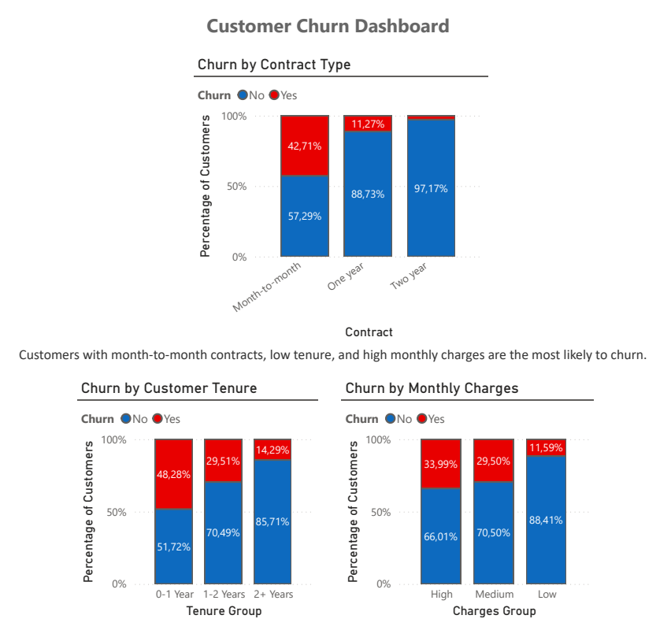

# Customer Churn Analysis

End-to-end customer churn analysis project using Python, SQL, and Power BI to identify high-risk customer segments and key drivers of churn.

**Key Result:**  
The overall churn rate is approximately **26.5%**, with significantly higher churn among customers on month-to-month contracts and with low tenure.

## Dashboard



## Quick Start

To reproduce this analysis:

1. **Clone repository** and navigate to project directory
2. **Install dependencies**: `pip install -r requirements.txt`
3. **Run notebook**: Open `notebooks/customer_churn_analysis.ipynb` in Jupyter
4. **Execute cells in order** - starts with data quality assessment
5. **View results**: Cleaned data saved to `data/churn_data_cleaned.csv`

All parameters are configured in `config.py`. Data dictionary available in `DATA_DICTIONARY.md`.

## Business Report

This report translates the analysis into business insights and strategic recommendations for reducing customer churn.

[Read the full report](report.md)

## Project Overview
This project analyzes customer churn in a telecommunications company using Python, SQL, and Power BI. The goal is to identify the key factors that influence customer churn and provide actionable business insights.

---

## Objectives
- Analyze customer behavior and churn patterns  
- Identify high-risk customer segments  
- Understand the impact of contract type, tenure, and pricing  
- Provide insights to improve customer retention  

---

## Tools & Technologies
- **Python** (Pandas, Seaborn, Matplotlib)  
- **SQL** (SQLite)  
- **Power BI** (Data Visualization & Dashboarding)  

---

## Dataset
This project uses the **Telco Customer Churn** dataset available on Kaggle.

The dataset contains information about **7,043 customers** and 21 features, including:
- Demographics (gender, senior citizen, etc.)
- Services subscribed (internet, security, streaming)
- Account information (contract, tenure, charges)

The target variable is **Churn**, indicating whether a customer has left the company. This variable already exists in the original dataset.


| Variable         | Description |
|------------------|------------|
| customerID       | Unique customer identifier |
| gender           | Customer gender |
| SeniorCitizen    | Indicates if the customer is a senior (1 = Yes, 0 = No) |
| tenure           | Number of months the customer has been with the company |
| MonthlyCharges   | Monthly subscription cost |
| TotalCharges     | Total amount charged to the customer |
| Contract         | Type of contract (Month-to-month, One year, Two year) |
| Churn            | Indicates if the customer left the company (Yes/No) |

---

## Project Workflow

1. Data Cleaning  
2. Exploratory Data Analysis (EDA)  
3. SQL-Based Analysis  
4. Data Visualization (Power BI)

---

## Key Insights

- Customers with **month-to-month contracts** show the highest churn rate (~42%), significantly higher than long-term contracts.
- Customers with **less than 1 year of tenure** have the highest churn (~48%), compared to ~14% for customers with more than 2 years.
- **Higher monthly charges** are associated with increased churn probability, especially in the high pricing segment (~34% churn).
- The highest-risk segment consists of customers who are:
  - New (low tenure)
  - On short-term (month-to-month) contracts
  - Paying higher monthly fees

---

## Power BI Dashboard

The interactive dashboard can be explored using the `.pbix` file available in the repository.

The Power BI dashboard highlights key churn drivers and enables quick identification of high-risk customer segments.

It includes:
- Churn rate by contract type
- Churn distribution by customer tenure
- Churn patterns across pricing segments 

---

## Business Recommendations

- Improve onboarding experience for new customers  
- Promote long-term contracts to increase retention  
- Review pricing strategies for high-paying customer segments   

---

## Project Structure

```bash
customer-churn-analysis/
│
├── data/
│   ├── churn_data_raw.csv                   # Raw dataset
│   └── churn_data_cleaned.csv               # Cleaned dataset
│
├── notebooks/
│   └── customer_churn_analysis.ipynb        # Data cleaning & EDA
│
├── dashboard/
│   ├── Dashboard.png                        # Dashboard preview
│   └── Customer_Churn_Dashboard.pbix        # Power BI file
│
├── sql/
│   └── churn.db                             # SQLite database
│
├── report.md                                # Business insights and recommendations
│
└── README.md                                # Project documentation
